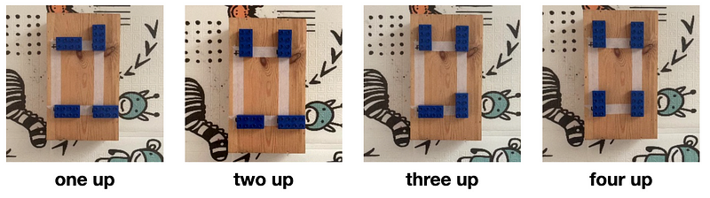
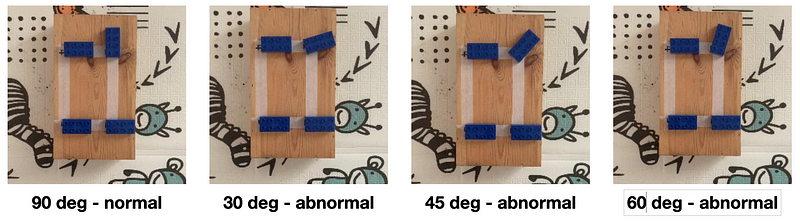
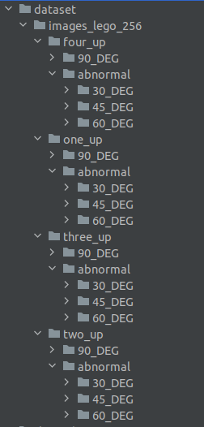

# Image_Anomaly_Detection

With Anomalib at hands, we can manage the images of a custom dataset, 
fine-tune state of the art pretrained models and test their ability 
to find abnormal images and localize the corresponding anomalous areas.
Here the link to the original project

https://github.com/openvinotoolkit/anomalib


## Installation

Build the environment based on python3.10
```bash
python3.10 -m venv venv
```

install all the packages using

```bash
pip install -r requirements.txt
```

if CUDA is not present, then comment torch==2.1.2+cu121 and torchvision==0.16.2+cu121 and use torch==2.1.2 and torchvision==0.16.2. Then install Anomalib 
```bash
pip install anomalib==1.0.1
anomalib install
```

## Dataset

I built a toy custom dataset by simplifying the specifications of a real industrial project. 
The problem is the  following. There is an industrial machine with many components. 
A sequence of actions is performed on each component, changing their arrangement from time to time. 
The request is to verify that, at the end of each step, the arrangement of the components was the desired one.
To schematize the machine and its components, I took a wooden box and four rectangular Lego pieces placing them at the corners of a rectangle. 
The initial configuration includes the Lego pieces all arranged horizontally. 
The first action consists in turning the piece on the top right counterclockwise by 90 degrees, 
so that from horizontal it is arranged vertically. Thus, the top left is turning counterclockwise by 90 degrees, 
thus the down left and, finally, the down right. 
As shown in figure, each of the final state is the correct configuration at the end of the rotation action.



At the end of each step, any other configuration different from the right one is to be considered an abnormal configuration. 
Actually, this means that the action on the component was not performed correctly. 
For example, as shown in the following figure, if at the end of the first step, the top right Lego piece is not completely rotated of 90 degrees, 
then the corresponding image is an anomaly image, and the anomaly is located in correspondence of the not well rotated Lego piece. 



Globally, the full dataset has the following structure and number of images with size 256x256 pixels

CATEGORY:  one_up

Normal 90_DEG - Number of images: 3638

Abnormal 60_DEG - Number of images: 955

Abnormal 45_DEG - Number of images: 967

Abnormal 30_DEG - Number of images: 965

------------------------------------------------------------------------
CATEGORY:  two_up

Normal 90_DEG - Number of images: 3628

Abnormal 60_DEG - Number of images: 921

Abnormal 45_DEG - Number of images: 1042

Abnormal 30_DEG - Number of images: 889

------------------------------------------------------------------------
CATEGORY:  three_up

Normal 90_DEG - Number of images: 3672

Abnormal 60_DEG - Number of images: 971

Abnormal 45_DEG - Number of images: 998

Abnormal 30_DEG - Number of images: 982

------------------------------------------------------------------------
CATEGORY:  four_up

Normal 90_DEG - Number of images: 3779

Abnormal 60_DEG - Number of images: 996

Abnormal 45_DEG - Number of images: 1058

Abnormal 30_DEG - Number of images: 1015

You can download the full dataset from the link

https://drive.google.com/file/d/1YgS897POEal8mkP3kngwcV5LI9vuyPuJ/view?usp=sharing

## Datamodule

In order to use the Anomalib APIs to load the data and then train and test the models on our custom dataset, 
the folder tree must be structured as follows




To manage the data of a custom dataset, in particular to split it in a train, 
test and validation subset, we can use the Folder class as show in the script data/inspect_FolderDataModule.py

The attributes have to be filled as follows

- name: the name of the category, i.e. the name of the folder where are stored the normal and abnormal images
- root: the root of the directory of the dataset, namely the root to the "one_up" directory
- normal_dir: the name of the folder where are stored the normal images, in this case "90_DEG"
- abnormal_dir: the name of the folder  where are stored the abnormal images, in this case "abnormal"
- task: we use CLASSIFICATION because the datset have just normal and abnormal images. If we also have the segmentation mask for each anomlous image we can use SEGMENTATION
- seed: this is set to repeat each time the same train, val and test split
- normal_split_ratio: ratio to split the normal training images and add to the test set in case the test set doesn't contain any normal images. By default is set to 0.2
- val_split_mode: determines how the validation dataset is obtained. By default is set to FROM_TEST
- val_split_ratio: fraction of the train or test images that will be reserved for validation. The images are taken from the train or test set depending on the val_split_mode. By default 0.5
- train_batch_size and eval_batch_size: set the value of the bach of images used to train and validate the model. By default are set to 32
- image_size: tuple to set the width and heigth of the image. Here is commented because we already resized the images to (256,256) pixels

Once the datamodule Folder object has been instatiated, we can exctract the train, 
validation and test dataloader to itarete over the batch of images. 
The images are automatically transformed to torch tensors normalized between 0 and 1. 
We can also extract the dataframes corresponding to the train, validation and test splits, 
check some statistics about the distribution of normal and abnormal images in the different datasets ad save them as .csv files.


## Train image models

From this page of the Anomalib documentation, we can find all the models implemented in the library and their original papers

https://anomalib.readthedocs.io/en/v1.0.1/markdown/guides/reference/models/image/index.html

Here you can find the scripts to train and test some different models. At the end of the test phase
the weights of the best model are saved in the torch format. You can download the weights of the trained ReverseDistillation
model for the one_up configuration at the following link. You have to put the model in the directory "results/ReverseDistillation/one_up/v0/weights/torch"

https://drive.google.com/file/d/1zYJMcZyncwqqUanS7mFxQkcwcfqR4QBJ/view?usp=sharing


### Patchcore

```bash
python train_anomalib/train_patchcore_anomalib.py --dataset_root /home/randellini/Image_Anomaly_Detection/dataset/images_lego_256/two_up --name_normal_dir 90_DEG --name_wandb_experiment patchcore_twoup_v1 --name two_up
```

### EfficientAD

```bash
python train_anomalib/train_efficientAD_anomalib.py --dataset_root /home/randellini/Image_Anomaly_Detection/dataset/images_lego_256/one_up --name_normal_dir 90_DEG --name_wandb_experiment effAD_oneup_v1 --name one_up --max_epochs 100 --patience 10 
```

### ReverseDistillation

```bash
python train_anomalib/train_reversedistillation_anomalib.py --dataset_root /home/randellini/Image_Anomaly_Detection/dataset/images_lego_256/one_up --name_normal_dir 90_DEG --name_wandb_experiment revdist_oneup_v1 --name one_up --max_epochs 100 --patience 10
```

### FastFlow

```bash
python train_anomalib/train_fastflow_anomalib.py --dataset_root /home/randellini/Image_Anomaly_Detection/dataset/images_lego_256/one_up --name_normal_dir 90_DEG --name_wandb_experiment effAD_oneup_v1 --name one_up --max_epochs 100 --patience 10
```

### Padim

```bash
python train_anomalib/train_padim_anomalib.py --dataset_root /home/randellini/Image_Anomaly_Detection/dataset/images_lego_256/one_up --name_normal_dir 90_DEG --name_wandb_experiment padim_oneup_v1 --name one_up --max_epochs 100 --patience 10
```


## Test image models

Once a model has been train, you can test the model in order to find the confusion matrix and 
how are distributed the scores for the normal and abnormal classification. You can use the following script

```bash
python infer_anomalib/test_model.py --path_torch_model /home/enrico/Projects/Image_Anomaly_Detection/results/ReverseDistillation/one_up/v0/weights/torch/model.pt --path_dataset /home/enrico/Projects/Image_Anomaly_Detection/dataset/images_lego_256/one_up --name one_up --dir_result /home/enrico/Projects/Image_Anomaly_Detection/results/ReverseDistillation/one_up/v0
```

## Inference with a trained model

The best model that has been exported in the torch format is useful to make an inference on a single image. 
With the TorchInferencer object I load those weights and set the device where I make the inference. 
Thus, once the image is loaded and preprocessed, I apply the predict function of the TorchInferencer to obtain the result object. 
This object has the following attributes:

- pred_label: 0 for a normal image, 1 for an abnormal one
- pred_score: the prediction score to be an anomalous image. Thus if the pred_label is 0, to find the pred_score to be normal I use 1-pred_score
- image: the original image
- heat_map: the heatmap for the test image. The hotter an area is, the higher the probability that it contains an anomaly
- pred_mask: the black and white mask corresponding to the anomalous areas
- segmentation: the segmented anomalous areas based on the extracted heatmap

You can infer a trained model using the following script

```bash
python infer_anomalib/infer_oneshot.py --path_torch_model /home/enrico/Projects/Image_Anomaly_Detection/results/ReverseDistillation/one_up/v0/weights/torch/model.pt  --path_image <path to an image> ----path_result /home/enrico/Projects/Image_Anomaly_Detection/results/ReverseDistillation/one_up/v0/example_inference.png
```

## Gradio application

With the best model exported in the torch format you can also play with a simple web app application built with Gradio.
You can use the following script

```bash
python infer_anomalib/app.py --path_torch_model /home/enrico/Projects/Image_Anomaly_Detection/results/ReverseDistillation/one_up/v0/weights/torch/model.pt 
```